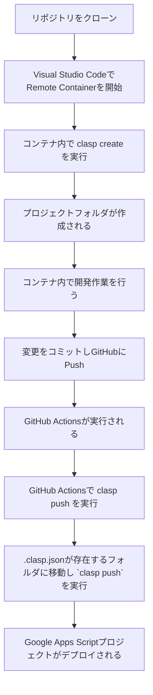

# docker-clasp-starter

チームで GAS を管理するための環境を簡単に整えるためのリポジトリです

# このリポジトリを使った GAS 開発の大まかな流れ



# 使い方

## 1. リポジトリをクローンする

リポジトリをクローンし、ディレクトリに移動します。

```bash
git clone
cd docker-clasp-starter
```

## Visual Studio Code でコンテナを開く

Visual Studio Code プロジェクトを開きます。

```bash
code .
```

Cmd + Shift + P でコマンドパレットを開き、`Remote-Containers: Reopen in Container`を選択します。

コンテナが開いたら、`npm install`を実行します。

```bash
npm install
```

## コンテナ内で clasp をセットアップする

### clasp login

```bash
clasp login
```

### clasp create

```bash
clasp create --type standalone --title "project_name"
```

## 作成したフォルダに移動して開発

```bash
cd project_name
touch code.gs
```

Typescript を使う場合は、以下のような `tsconfig.json` を作成します。

```json
{
  "compilerOptions": {
    "lib": ["esnext"],
    "experimentalDecorators": true
  }
}
```

## GitHub Actions 用の環境変数を設定する

コンテナ内で `clasp login` を実行すると、`/home/node/.clasprc.json.` が作成されます。

このファイルを `cat` し、出力を全てコピーして GitHub のリポジトリの [Settings] => [Secrets and variables] => [Actions] => [New repository secret] に `CLASP_TOKEN` という名前で作成します。

```bash
cat /home/node/.clasprc.json
```

## 開発が終わったらプッシュ

リポジトリをプッシュすると、GitHub Actions で `.clasp.json` があるフォルダを全て探して、それぞれのフォルダで `clasp push` が行われます。

# 補足

## コンテナ内で `clasp login` を実行する理由

`clasp login` は必ずコンテナ内で行わないといけないわけではありません。別の端末などで作った `.clasprc.json` の内容を `CLASP_TOKEN` に設定しても構いませんし、手打ちでプロジェクトフォルダや `.clasp.json` を作っても構いません。
Clasp の開発環境セットアップや、プロジェクトの作成などを誰でもできるように、コンテナ内で行うように記載しております。

## `project1` フォルダはなんのためにあるの？

`project1` フォルダはサンプルプロジェクトです。

不要であれば削除し、新しく `clasp create --type standalone --title "project_name"` でフォルダを作成してください。（直下にフォルダを作成すると、GitHub Actions で `clasp push` が実行されないので、必ず `--title` オプションをつけて実行すること）
